<div align="center">


<h1>Firewall as Code (FWAC)</h1>

<p><strong>The Global Standard for Industrialized Network Security, Automated Policy Orchestration, and Zero-Trust Guardrails</strong></p>

[]()
[]()
[]()
[]()

<br/>

> **"Industrializing network security to automate firewall policies, govern traffic flows, and accelerate zero-trust transformation across the enterprise."** 
> Firewall as Code (FWAC) is a flagship repository designed to enable organizations to define, deploy, audit, and optimize firewall policies through structured code, multi-cloud orchestration, and real-time security analytics.

</div>

---

## 🏛️ Executive Summary

**Firewall as Code (FWAC)** is a flagship platform designed for CISOs, CTOs, and Security Engineers. In the era of multi-cloud and microservices, manual firewall rule management is a significant security risk and operational bottleneck. FWAC transitions organizations from "Manual Ticket-Based Rules" to "Industrialized Security Operations," where network guardrails are embedded directly into the infrastructure lifecycle.

This platform provides an industrialized approach to **Network Security Orchestration**, delivering production-ready **Policy Engines**, **Automated Audits**, **Traffic Analytics**, and **Executive Dashboards**. It enables organizations to enforce global security standards across Azure Firewall, AWS Network Firewall, GCP Cloud Firewall, and 3rd party appliances (Palo Alto, Fortinet), ensuring continuous protection and operational agility.

---

## 💡 Why Firewall-as-Code Matters

FWAC is the "perimeter guardrail" of the modern cloud-native organization:
- **Preventive Guardrails**: Stopping insecure or unapproved traffic rules before they are even applied (via CI/CD gates).
- **Institutional Consistency**: Enforcing the same security standards across multi-cloud estates without vendor-specific manual overhead.
- **Automated Rule Hygiene**: Real-time identification and removal of orphaned, shadowed, or redundant rules that increase the attack surface.
- **Zero-Trust Acceleration**: Moving towards micro-segmentation and identity-aware access controls through automated policy orchestration.

---

## 🚀 Business Outcomes

### 🎯 Strategic Security Impact
- **Elimination of "Rule Bloat"**: Automating the lifecycle of firewall rules to maintain a lean, high-performance security posture.
- **Guaranteed Compliance**: Ensuring 100% adherence to regulatory standards (PCI-DSS, HIPAA, FedRAMP) through automated policy auditing.
- **Reduced Breach Risk**: Blocking malicious traffic and lateral movement through fine-grained, automated micro-segmentation.
- **Improved Engineering Velocity**: Self-service firewall rule requests with automated security validation and deployment.

---

## 🏗️ Technical Stack

| Layer | Technology | Rationale |
|---|---|---|
| **Policy Engine** | OPA / Terraform Sentinel | Universal standard for defining security guardrails and rule validations as structured code. |
| **Orchestration** | Python (FastAPI) | High-performance gateway for policy evaluation, rule deployment, and analytics. |
| **Infrastructure** | Terraform | Primary IaC tool for provisioning multi-cloud firewalls and security groups. |
| **Frontend** | React 18, Vite | Premium portal for executive dashboards, traffic heatmaps, and rule compliance scorecards. |
| **Monitoring** | Prometheus / Grafana | Real-time observability for traffic flows, threat detection, and engine health. |

---

## 📐 Architecture Storytelling: 90+ Diagrams

### 1. Executive High-Level Architecture
The holistic vision of the enterprise firewall-as-code journey.

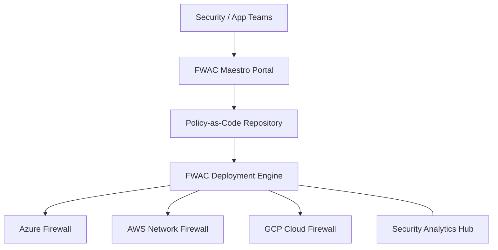

### 2. Detailed Platform Topology
The internal service boundaries and management layers of the industrialized FWAC platform.

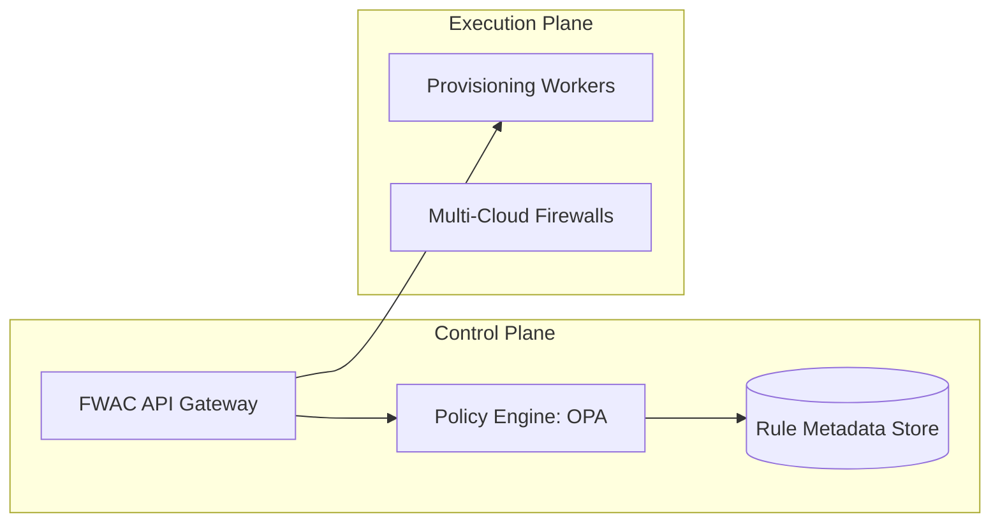

### 3. Billing Data to Report Path (Adapted: Traffic to Security Report)
Tracing the path from a network event to a security compliance report.

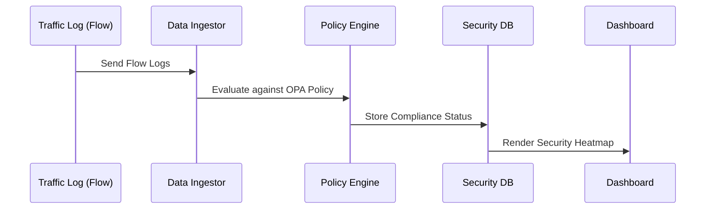

### 4. Showback Control Plane (Adapted: Firewall Control Plane)
The "Brain" of the framework managing global institutional security standards and automated policy workflows.

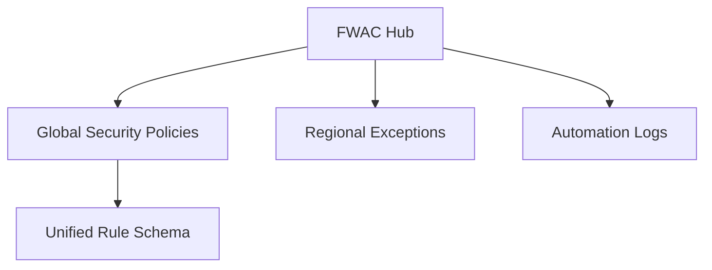

### 5. Multi-Cloud Topology
Synchronizing security policies across Azure, AWS, and GCP for a unified perimeter estate.

```mermaid
graph LR
    Azure[Azure Policy] <-> Bridge[FWAC Sync] <-> AWS[AWS SCP/Config]
    Bridge <-> GCP[GCP Org Policy]
```

### 6. Regional Deployment Model
Hosting security management nodes close to global engineering hubs for low-latency rule updates.

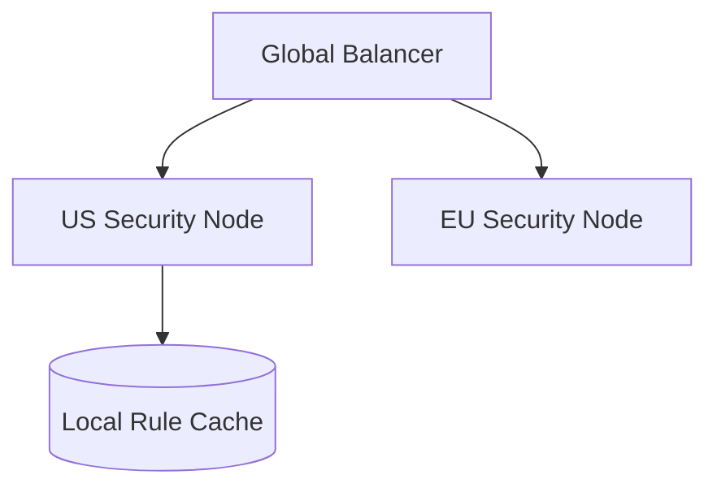

### 7. DR Failover Model
Ensuring platform continuity for critical security policy enforcement and incident response.

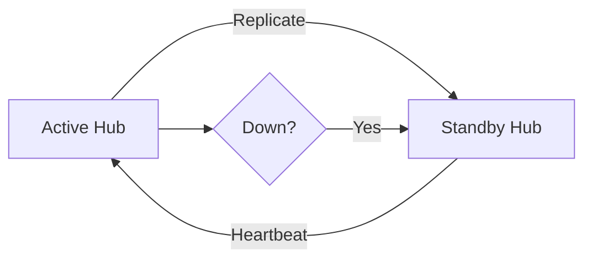

### 8. API Gateway Architecture
Securing and throttling the entry point for firewall rule evaluation and deployment requests.

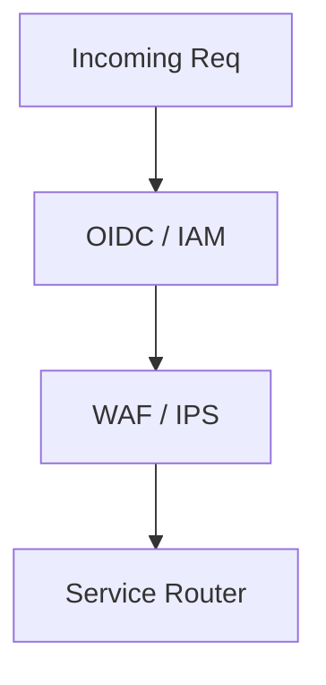

### 9. Queue Worker Architecture
Managing long-running policy audits, rule deployments, and traffic log processing.

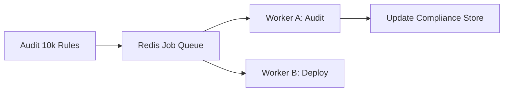

### 10. Dashboard Analytics Flow
How raw traffic telemetry becomes executive institutional security compliance heatmaps.

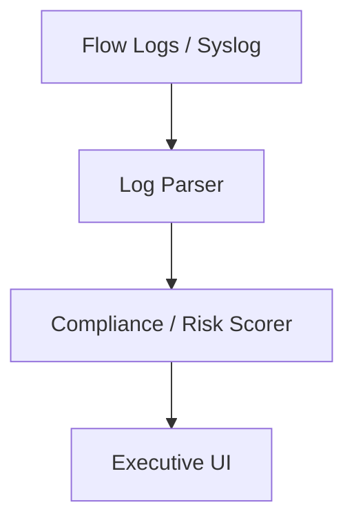

### 11. FWAC Operating Model
Defining the institutional roles and responsibilities for network security automation.

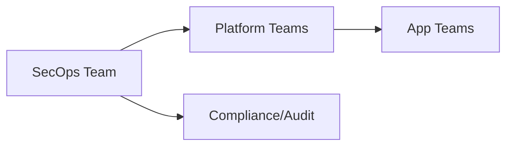

### 12. Security + Engineering Cadence
Standardizing the rhythm of monthly policy reviews and rule cleanup.

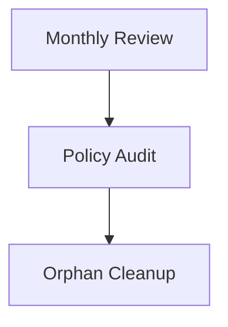

### 13. Application Segment Map
Mapping cloud application environments to specific network security segments.

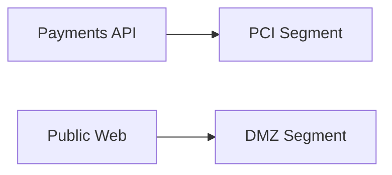

### 14. Identity-Aware Access Flow
Synchronizing Entra ID / Okta identities with dynamic firewall rules.

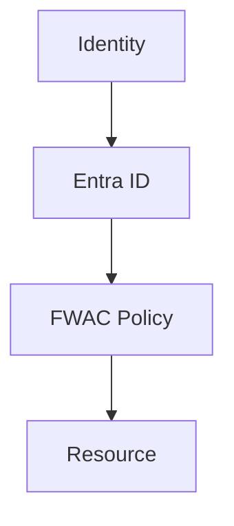

### 15. Policy Approval Workflow
The institutional process for validating and approving new firewall rule requests.

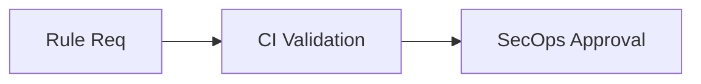

### 16. Automated Deployment Cycle
The automated sequence for deploying verified rules across multi-cloud firewalls.

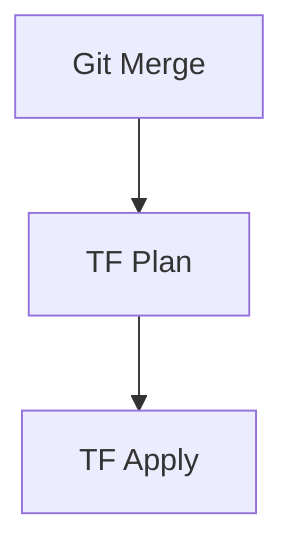

### 17. Continuous Compliance Cadence
The formal schedule for reviewing firewall compliance drift and risk metrics.

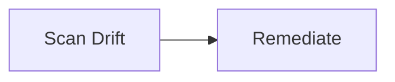

### 18. Quarterly Security Review Model
Reporting network security posture and threat mitigation outcomes to leadership.

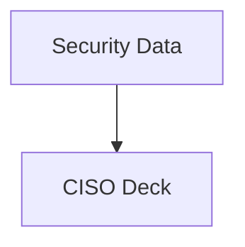

### 19. Security Steering Committee
The governing body for enterprise network security strategy and architecture.

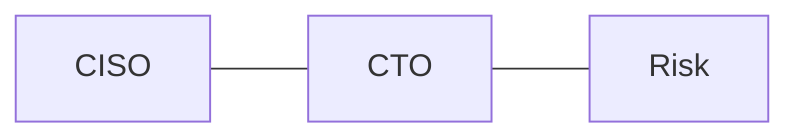

### 20. DevSecOps Community of Practice
The grass-roots forum for sharing firewall-as-code automation patterns.

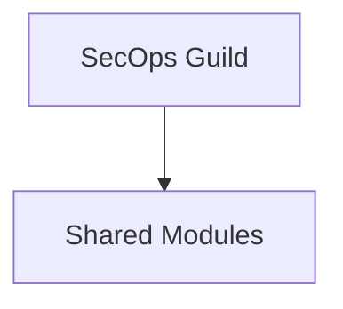

### 21. Standard Rule Workflow
The simplified path for standard application access requests.

```mermaid
graph LR
    Req[Standard Req] --> Auto[Auto-Approve] --> FW[Update]
```

### 22. Shared Security Hub Model
Orchestrating policies for centralized Hub-and-Spoke security architectures.

```mermaid
graph TD
    Hub[Sec Hub] --> SpokeA[App VNET]
    Hub --> SpokeB[Data VNET]
```

### 23. Micro-segmentation Model
Enforcing zero-trust at the individual workload/container level.

```mermaid
graph LR
    PodA[Pod A] <-> FW[FWAC Policy] <-> PodB[Pod B]
```

### 24. Threat-Intelligence Based Filtering
Automatically updating blocklists based on global threat intelligence feeds.

```mermaid
graph TD
    Feed[Threat Intel] --> FWAC[FWAC Engine] --> Block[Edge Block]
```

### 25. Geofencing Policy Workflow
Restricting traffic flows based on geographic origin/destination standards.

```mermaid
graph LR
    Req[Inbound] --> GeoCheck[Allowed Region?] --> FW[Permit]
```

### 26. Environment Separation Model
Visualizing the security boundaries between Prod, Staging, and Dev.

```mermaid
graph TD
    Total[Global] --> Prod[High Trust]
    Total --> Dev[Lower Trust]
```

### 27. Cross-Cloud Policy Sync
Ensuring identical security postures across Azure and AWS workloads.

```mermaid
graph LR
    Azure[AZ Policy] <-> Sync[Sync Hub] <-> AWS[AWS Policy]
```

### 28. Application Security Group (ASG) Model
Mapping rules to application identities rather than static IP addresses.

```mermaid
graph TD
    Group[Web ASG] --> Rule[Allow HTTPS] --> VM[Instance]
```

### 29. Service Tag Governance
Automating the use of cloud-native service tags for simplified rule management.

```mermaid
graph LR
    Req[Storage Access] --> Tag[Storage Service Tag] --> FW[Allow]
```

### 30. Multi-Region Policy Replication
Synchronizing security policies across global cloud regions for DR and consistency.

```mermaid
graph TD
    East[US-East] --- Hub[FWAC Sync] --- West[US-West]
```

### 31. Rule Shadowing Detection
Identifying rules that are completely overlapped by existing higher-priority rules.

```mermaid
graph LR
    New[New Rule] <-> Exist[Existing] --> Shadow[Shadow Alert]
```

### 32. Rule Recency / Aging Model
Identifying rules that have not seen traffic for extended periods.

```mermaid
graph TD
    History[Flow Data] --> Age[Rule Age] --> Cleanup[Retire]
```

### 33. Automated Conflict Resolution
Detecting and flagging contradictory rules in a multi-provider environment.

```mermaid
graph LR
    Allow[Allow 80] <-> Deny[Deny 80] --> Conflict[Flag]
```

### 34. Compliance Waterfall (PCI-DSS)
Breaking down firewall standards into specific regulatory control mappings.

```mermaid
graph TD
    PCI[Requirement 1] --> Rules[FW Rules]
```

### 35. Risk-Based Rule Scoring
Assigning a risk score to every firewall rule based on port/protocol/source.

```mermaid
graph LR
    Rule[Any-Any] --> Score[Critical Risk]
```

### 36. Automated Penetration Testing Link
Integrating showback from automated red-team tools into firewall audits.

```mermaid
graph TD
    Test[Scan] --> Path[Exploitable?] --> FW[Block Path]
```

### 37. Security Posture Influence Map
Visualizing how firewall automation directly reduces the enterprise cyber-risk.

```mermaid
graph LR
    Auto[Auto-Audit] --> Posture[Improved Score]
```

### 38. Incident Response Automation
Automatically hardening the perimeter during a detected security incident.

```mermaid
graph TD
    Alert[SOC Alert] --> FWAC[Isolate Segment]
```

### 39. Peer Security Benchmarking
Comparing a business unit's network security score against company standards.

```mermaid
graph LR
    BU_A[Team A] <-> Corp[Gold Standard]
```

### 40. Vulnerability Exposure Funnel
Filtering raw vulnerability scans into prioritized firewall mitigation tasks.

```mermaid
graph TD
    Scan[Vuln Scan] --> Path[Network Exposure?] --> FW[Compensating Control]
```

### 41. Kubernetes NetworkPolicy Orchestration
Breaking down cluster-level segmentation into pod-level security code.

```mermaid
graph LR
    K8s[Cluster] --> NP[NetworkPolicy] --> Pod[App]
```

### 42. Ingress Controller Guardrails
Orchestrating WAF and firewall rules at the application entry point.

```mermaid
graph TD
    Ingress[Ingress] --> WAF[WAF Rule] --> App[Service]
```

### 43. Pipeline-Integrated Security Scans
Capturing and blocking insecure network code before it reaches the cloud.

```mermaid
graph LR
    Code[TF Code] --> Scan[Checkov/TFSec] --> Gate[Block Merge]
```

### 44. Ephemeral Security Groups
Managing the lifecycle of short-lived security rules for temporary workloads.

```mermaid
graph TD
    Lab[Lab Start] --> Rule[Open] --> Cleanup[Close]
```

### 45. Off-Hours Traffic Hardening
Reporting on the security impact of automated off-hours perimeter lockdowns.

```mermaid
graph LR
    Night[Night Mode] --> Block[External SSH]
```

### 46. Rule Complexity Monitoring
Tracking the mathematical complexity of firewall rule sets for performance.

```mermaid
graph TD
    Rules[1000 Rules] --> Perf[Latency Impact]
```

### 47. Traffic Flow Visualization
Mapping real-world traffic flows against the intended security architecture.

```mermaid
graph LR
    Flow[Real Traffic] <-> Model[Policy Model] --> Drift[Gap!]
```

### 48. Data Plane Isolation Model
Governing the network separation of sensitive data platforms.

```mermaid
graph TD
    Data[SQL DB] --> Seg[Isolated Subnet]
```

### 49. VPN / ExpressRoute Access Governance
Identifying and attributing traffic flows from on-premises/hybrid links.

```mermaid
graph LR
    OnPrem[DC] --> ER[ExpressRoute] --> FW[Security Gate]
```

### 50. Architecture Review for Security
Integrating FWAC rule projections into the standard architecture review process.

```mermaid
graph TD
    Design[Design] --> RulePlan[Security Plan] --> Approve[Go-Live]
```

### 51. Executive Security KPI Review
Providing the CISO with a unified view of firewall compliance and coverage.

```mermaid
graph LR
    KPI[Protected %] --> CISO[Board Report]
```

### 52. Segment Health Scorecard
Reporting the security health per network segment (e.g., DMZ Score).

```mermaid
graph TD
    Risk[Threats] / Rules[Policy] = Scorecard[Health]
```

### 53. Cross-Provider Rule Consistency
Gamifying SecOps by ensuring parity between Azure, AWS, and GCP security.

```mermaid
graph LR
    Azure[AZ 98%] <-> AWS[AWS 95%]
```

### 54. Threat Heatmap Model
Identifying which network segments are under the most frequent attack.

```mermaid
graph TD
    DMZ[Hot] --- Internal[Cool]
```

### 55. Audit Accuracy Dashboard
Measuring the deviation between intended security code and actual cloud state.

```mermaid
graph LR
    Git[Code] <-> Cloud[State] --> Drift[0.1%]
```

### 56. Monthly Compliance Statement
The automated flow for creating security posture reports for every application.

```mermaid
graph TD
    Data[Data] --> Template[Security View] --> PDF[Report]
```

### 57. Zero-Trust Progress Dashboard
Mapping the transition from "Implicit Trust" to "Explicit Authorization."

```mermaid
graph LR
    Old[Flat Net] --> New[Zero Trust]
```

### 58. Security Value Realization
Measuring the ROI of automated firewall management in terms of saved hours.

```mermaid
graph TD
    Manual[100 hrs] <-> Auto[5 hrs]
```

### 59. Threat Attribution Model
Attributing detected threats to specific application security gaps.

```mermaid
graph LR
    Attack[Attack] --> Gap[Missing Rule] --> Team[Action]
```

### 60. Application Risk Profile Model
Linking network exposure to the criticality of the underlying business app.

```mermaid
graph TD
    App[Critical App] + Open[Open Port] = Risk[Extreme]
```

### 61. Metrics Pipeline
The automated flow for capturing, processing, and storing security metrics.

```mermaid
graph LR
    Ingest[Ingest] --> Process[Process] --> Store[Store]
```

### 62. Logging Architecture
The multi-layered approach to capturing firewall platform activity and audit.

```mermaid
graph TD
    Auth[Auth] --- API[API] --- Apply[Apply]
```

### 63. Tracing Model
Observing the path of long-running policy audits and deployment jobs.

```mermaid
graph LR
    Req[Req] --> Queue[Redis] --> Worker[Engine]
```

### 64. Security Data Quality Workflow
Automating the verification of log integrity and policy completeness.

```mermaid
graph TD
    Data[Data] --> Check[Valid?] --> Proceed[Process]
```

### 65. Access Governance Model
Defining who can modify specific firewall rule segments (RBAC).

```mermaid
graph LR
    Role[Lead] --> Perm[Edit Prod Rules]
```

### 66. Rule Change Approval Workflow
The institutional process for defining and approving network exceptions.

```mermaid
graph TD
    Proposed[Proposed] --> Review[Board] --> Active[Active]
```

### 67. Security Change Management Cycle
Governing updates to the FWAC engine and policy validation models.

```mermaid
graph LR
    Dev[Dev] --> Test[UAT] --> Release[Prod]
```

### 68. Incident Escalation Model
The automated response path for firewall deployment failures.

```mermaid
graph TD
    Fail[Deploy Fail] --> Pager[Alert] --> Triage[On-Call]
```

### 69. SecOps Maturity Roadmap
The journey from "Manual Firewalls" to "Autonomous Security Orchestration."

```mermaid
graph LR
    Crawl[Scripts] --> Run[Autonomous]
```

### 70. Continuous Improvement Loop
Evolving security dashboards based on SOC and Audit feedback.

```mermaid
graph TD
    Retro[Retro] --> Update[Dash Update]
```

### 71. AI Rule Advisor Flow
Using LLMs to suggest the safest and most efficient rule configurations.

```mermaid
graph LR
    Scan[Analyze Req] --> AI[AI Advice] --> Rule[Best Rule]
```

### 72. Autonomous Threat Mitigation
Reporting on the performance of self-defending network infrastructure.

```mermaid
graph TD
    AI[AI] --> AutoAction[Block Source]
```

### 73. Multi-Provider Operating Model
Governing network security across different cloud vendors and hardware.

```mermaid
graph LR
    Global[Global Hub] --> Regional[Local Cloud]
```

### 74. M&A Security Integration Flow
Rapidly onboarding and auditing the firewall state of acquired companies.

```mermaid
graph TD
    Acq[Acquired Co] --> Audit[Audit] --> Merge[Sync]
```

### 75. Sovereign Cloud Security Model
Managing network policies in restricted regions with localized control.

```mermaid
graph LR
    Gov[Sovereign] --> LocalPolicy[Local Gate]
```

### 76. Cost + Security Optimization Model
Identifying "Double Win" targets that reduce both network cost and risk.

```mermaid
graph TD
    Save[$] <-> Risk[Attack Surface]
```

### 77. Developer Nudging Workflow
Automating the "soft enforcement" of network security standards via Slack.

```mermaid
graph LR
    Insecure[Insecure Code] --> Nudge[Slack Message]
```

### 78. Real-time Traffic Streaming Model
Using streaming data to provide second-by-second visibility into perimeter events.

```mermaid
graph TD
    Event[Packet] --> Stream[Kafka] --> Dash[Real-time]
```

### 79. Security Innovation Roadmap
Planning the next 36 months of FWAC platform evolution.

```mermaid
graph LR
    Year1[Visibility] --> Year3[AI-Mitigation]
```

### 80. Strategic Security Transformation
The multi-year mission to instill firewall-as-code culture across the enterprise.

```mermaid
graph TD
    Phase1[Setup] --> Phase3[Culture]
```

### 81. Terraform Demo Environment Flow
Automating the creation of sample network estates for security training.

```mermaid
graph LR
    Req[Req] --> TF[Provision] --> Demo[Live Net]
```

### 82. Policy Sync Lifecycle
Ensuring high-availability for background policy syncs and audits.

```mermaid
graph TD
    Task[Task] --> Worker[Worker] --> Success[Ack]
```

### 83. Security Data Recovery Model
Governing the protection and testing of historical security and audit data.

```mermaid
graph LR
    Active[Active] --> Snap[Snap] --> Test[Monthly]
```

### 84. SIEM / SOAR Integration Workflow
Synchronizing firewall events with corporate security operations (Sentinel/Splunk).

```mermaid
graph TD
    FWAC[FWAC Hub] --> SIEM[Sentinel] --> SOAR[Automated Response]
```

### 85. CMDB Security Sync Model
Linking network resources to the corporate asset database for risk context.

```mermaid
graph LR
    FW[Rule] <-> CMDB[System ID]
```

### 86. IoT / Edge Security Flow
Capturing and analyzing telemetry from remote edge firewall appliances.

```mermaid
graph TD
    Edge[Edge App] --> Usage[Process] --> Rule[Update]
```

### 87. Security Data Retention Governance
Enforcing institutional policies for historical traffic and audit data aging.

```mermaid
graph LR
    Hot[90 days] --> Cold[1yr Archive]
```

### 88. Tenant Security Baseline
Auditing individual business units against the enterprise security baseline.

```mermaid
graph TD
    Gold[Enterprise Gold] <-> BU[Business Unit]
```

### 89. Security PMO Operating Model
The institutional structure for the central Network Security Project Management Office.

```mermaid
graph LR
    PMO[PMO] --- Teams[Teams]
```

### 90. Global Security Hub Model
The institutional structure for 24/7 global firewall-as-code operations.

```mermaid
graph LR
    Follow[Follow the Sun] --- Hub[Security Hub]
```

---

## 🔬 Firewall as Code Methodology

### 1. The FWAC Pillars
Our platform is built on four core pillars:
- **Codification**: 100% of network rules defined as structured, version-controlled code.
- **Validation**: Automated CI/CD gates that prevent insecure rules from reaching production.
- **Orchestration**: Seamless deployment across heterogeneous cloud and hardware estates.
- **Hygiene**: Continuous auditing and cleanup of orphaned, shadowed, and risky rules.

### 2. Zero-Trust Transformation
We provide the technical foundation for shifting the organization from a "Permissive Perimeter" to "Explicit Authorization."

---

## 🚦 Getting Started

### 1. Prerequisites
- **Azure / AWS / GCP** security access.
- **Terraform** (latest version).
- **OPA (Open Policy Agent)** installed.

### 2. Local Setup
```bash
# Clone the repository
git clone https://github.com/Devopstrio/firewall-as-code.git
cd firewall-as-code

# Start the FWAC Control Plane
docker-compose up --build
```
Access the Security Portal at `http://localhost:3000`.

---

## 🛡️ Governance & Security
- **Rule Integrity**: Automated verification of security code from commit to cloud.
- **Institutional RBAC**: Granular access control for network security management.
- **Audit Ready**: Built-in evidence generation for regulatory compliance audits.

---
<sub>&copy; 2026 Devopstrio &mdash; Engineering the Future of Industrialized Firewall as Code.</sub>
