<div align="center">


<h1>Firewall as Code</h1>

<p><strong>The Institutional-Grade Platform for Network Security Orchestration, Code-Driven Segmentation, and Multi-Cloud Firewall Governance.</strong></p>

[]()
[]()
[]()

<br/>

> **"Industrializing network security to automate policies and secure perimeters."** 
> **Firewall as Code** is an enterprise-grade platform designed to provide a secure, measurable, and highly automated foundation for global network operations. It orchestrates the complex lifecycle of firewall policies—from code-driven authoring and impact analysis to distributed multi-cloud enforcement and unified network auditing.

</div>

---

## 🏛️ Executive Summary

Fragmented security silos and manual firewall rule workflows are strategic operational liabilities; lack of centralized network orchestration is a primary barrier to organizational security maturity. Organizations fail to maintain a secure network foundation not because of a lack of firewalls, but because of fragmented security standards, lack of automated policy validation, and an inability to orchestrate network perimeters with operational precision.

This platform provides the **Network Security Intelligence Plane**. It implements a complete **Enterprise Firewall-as-Code Framework**, enabling Security and Network teams to manage global perimeters as first-class citizens. By automating the identification of rule bottlenecks through real-time telemetry analysis and orchestrating the deployment of secure segmentation policies, we ensure that every organizational service—from core database enclaves to distributed edge security perimeters—is governed by default, audited for history, and strictly aligned with institutional security frameworks.

---

## 📐 Architecture Storytelling: Principal Reference Models

### 1. Principal Architecture: Global Firewall-as-Code & Network Security Intelligence Plane
This diagram illustrates the end-to-end flow from code-driven policy ingestion and multi-cloud orchestration to perimeter enforcement, safety validation, and institutional network auditing.

```mermaid
graph LR
    %% Subgraph Definitions
    subgraph PolicyIngress["Security Code & Rule Ingress"]
        direction TB
        Security_Code["Terraform / Bicep / HCL"]
        Compliance_Rules["NIST / PCI / SOC Baselines"]
        Threat_Feeds["Real-time Blocklists / Intel"]
    end

    subgraph IntelligenceEngine["Network Security Intelligence Hub"]
        direction TB
        API["FastAPI Firewall Gateway"]
        PolicyOrchestrator["Global Policy & Rule Hub"]
        SegmentGuard_Hub["Zero-Trust Segmentation Hub"]
        AIOps_Validator["Drift & Deny Analysis Hub"]
    end

    subgraph OperationsPlane["Distributed Multi-Cloud Fleet"]
        direction TB
        AzureFirewall["Managed Azure Firewall Hubs"]
        AWSNetworkFirewall["Managed AWS Firewall Hubs"]
        GCPCloudArmor["Managed GCP Armor Hubs"]
    end

    subgraph OperationsHub["Institutional Network Hub"]
        direction TB
        Scorecard["Firewall Maturity Scorecard"]
        Analytics["Policy Flow & Deny Velocity Stats"]
        Audit["Forensic Network Metadata Lake"]
    end

    subgraph DevOps["Firewall-as-Code Framework"]
        direction TB
        TF["Terraform Security Modules"]
        DriftBot["Rule & Config Drift Validator"]
        ChatOps["Network Operations Hub"]
    end

    %% Flow Arrows
    PolicyIngress -->|1. Submit Policy| API
    API -->|2. Orchestrate Rule| PolicyOrchestrator
    PolicyOrchestrator -->|3. Apply Segment Policy| SegmentGuard_Hub
    SegmentGuard_Hub -->|4. Assess Drift| AIOps_Validator
    
    AIOps_Validator -->|5. Execute Provision| OperationsPlane
    OperationsPlane -->|6. Notify Status| ChatOps
    API -->|7. Visualize Health| Scorecard
    
    Scorecard -->|8. Track Maturity| Analytics
    Scorecard -->|9. Record Provision| Audit
    
    TF -->|10. Provision Backbone| IntelligenceEngine
    DriftBot -->|11. Inject Security Risk| PolicyOrchestrator
    Audit -->|12. Improve Operations| AzureFirewall

    %% Styling
    classDef ingress fill:#f5f5f5,stroke:#616161,stroke-width:2px;
    classDef intel fill:#e8eaf6,stroke:#1a237e,stroke-width:2px;
    classDef operations fill:#e1f5fe,stroke:#01579b,stroke-width:2px;
    classDef ops fill:#ede7f6,stroke:#311b92,stroke-width:2px;
    classDef devops fill:#e8f5e9,stroke:#1b5e20,stroke-width:2px;

    class PolicyIngress ingress;
    class IntelligenceEngine intel;
    class OperationsPlane operations;
    class OperationsHub ops;
    class DevOps devops;
```

### 2. The Firewall Policy Lifecycle Flow
The continuous path of a network security policy from initial author (code) and validate (lint/test) to active deploy (IaC), enforce (policy), and institutional forensic auditing.

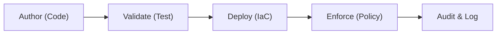

### 3. Distributed Firewall Policy Topology
Strategically orchestrating firewall policies across global data centers, multi-cloud VNets/VPCs, and edge security perimeters, providing a unified institutional view of global network health and policy readiness.

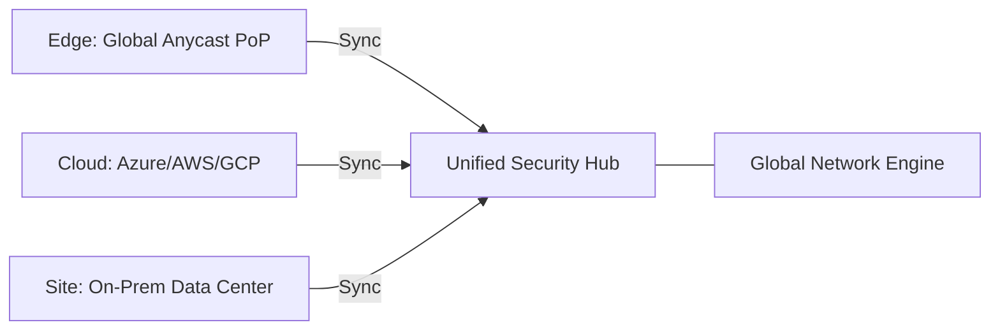

### 4. Zero-Trust Micro-Segmentation & Policy Flow
Executing complex logic for securing the bridge between application workloads, database enclaves, and untrusted zones, ensuring every organizational identity is verified and every network access is according to institutional standards.

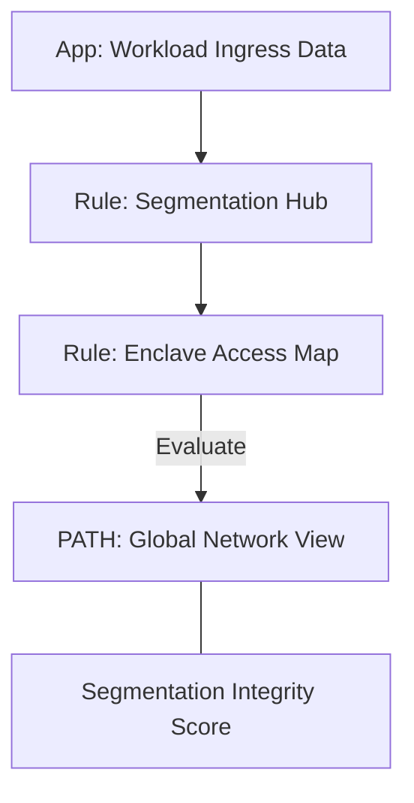

### 5. Multi-Cloud Firewall Federation & Governance Flow
Automatically managing unified firewall policies across Azure Firewall, AWS Network Firewall, and GCP Cloud Armor, ensuring institutional data residency and security boundaries by default.

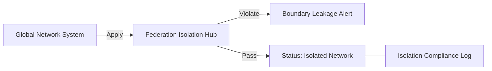

### 6. Encryption & Perimeter Protection Flow (Security Standard)
Managing the lifecycle of a perimeter request, automatically enforcing institutional TLS inspection and DDoS protection standards as required by security policy, ensuring zero-latency security confidence.

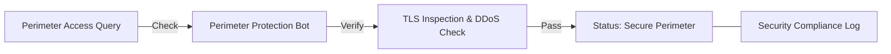

### 7. Institutional Firewall Maturity Scorecard
Grading organizational performance based on key indicators: Policy Coverage Grade, Automation Percentage, and Rule Conflict Index.

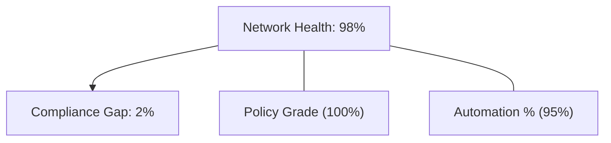

### 8. Identity & RBAC for Firewall Governance
Managing fine-grained access to security hubs, provisioning workers, and audit logs between Firewall Architects, Network Security Engineers, and Policy Auditors.

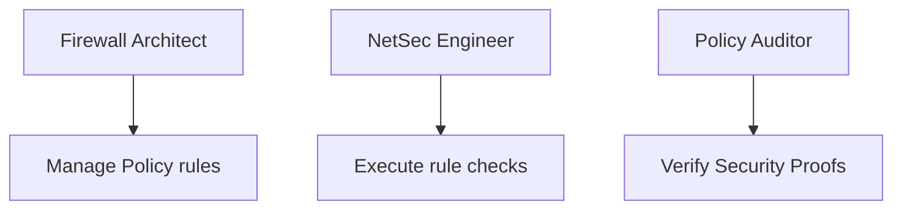

### 9. IaC Deployment: Firewall-as-Code Framework
Using modular Terraform to deploy and manage the versioned distribution of the network tracking hubs, segment protection workers, and forensic metadata lakes.

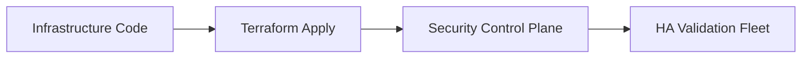

### 10. AIOps Firewall Drift & Risk Validation Flow
Using advanced analytics to identify sudden surges in denied traffic, unauthorized rule changes, suspicious configuration drifts, or unusual network pattern changes that could result in institutional risk.

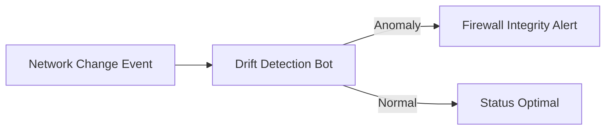

### 11. Metadata Lake for Forensic Firewall Audit
Storing long-term records of every rule change (metadata), every policy deployment recorded, and every security event for institutional record-keeping, compliance auditing, and post-provisioning forensics.

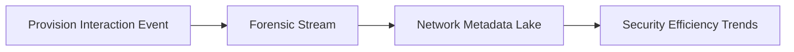

---

## 🏛️ Core Governance Pillars

1.  **Unified Foundation Coordination**: Maximizing resilience by centralizing all network measurement through a single institutional plane.
2.  **Automated Policy Provisioning**: Eliminating "manual rule" scenarios through proactive orchestration and pattern verification.
3.  **Sequential Segment Intelligence**: Ensuring zero-interruption operations through dependency-aware segment-driven network engineering.
4.  **Zero-Trust Perimeter Protection**: Automatically enforcing identity-based access and rule evaluation across all network tiers.
5.  **Autonomous Operations Logic**: Guaranteeing reliability through automated industry-specific network monitoring runbooks.
6.  **Full Network Auditability**: Immutable recording of every policy change and rule provision for institutional forensics.

---

## 🛠️ Technical Stack & Implementation

### Security Engine & APIs
*   **Framework**: Python 3.11+ / FastAPI.
*   **Policy Engine**: Custom Python-based logic for multi-cloud network provisioning and DORA-style security metrics.
*   **Integrations**: Native connectors for Azure Firewall, AWS Network Firewall, and GCP Cloud Armor APIs.
*   **Persistence**: PostgreSQL (Security Ledger) and Redis (Live Network State).
*   **Auth Orchestrator**: Federated OIDC/SAML for least-privilege network management access.

### Governance Dashboard (UI)
*   **Framework**: React 18 / Vite.
*   **Theme**: Dark, Slate, Indigo (Modern high-fidelity network aesthetic).
*   **Visualization**: D3.js for network topologies and Recharts for deny velocity analytics.

### Infrastructure & DevOps
*   **Runtime**: AWS EKS or Azure Kubernetes Service (AKS) for management plane.
*   **Network Hub**: Managed event sourcing for immutable network security timeline reconstruction.
*   **IaC**: Modular Terraform for deploying the network landing zone and validation fleet.

---

## 🏗️ IaC Mapping (Module Structure)

| Module | Purpose | Real Services |
| :--- | :--- | :--- |
| **`infrastructure/firewall_hub`** | Central management plane | EKS, PostgreSQL, Redis |
| **`infrastructure/enforcers`** | Distributed policy provisioners | Azure, AWS, GCP APIs |
| **`infrastructure/rule_pipes`** | Policy Ingestion Hubs | Webhooks, Lambda |
| **`infrastructure/auditing`** | Forensic network sinks | S3, Athena, Quicksight |

---

## 🚀 Deployment Guide

### Local Principal Environment
```bash
# Clone the landing zone platform
git clone https://github.com/devopstrio/firewall-as-code.git
cd firewall-as-code

# Configure environment
cp .env.example .env

# Launch the Firewall stack
make init

# Trigger a mock policy update and automated rule validation simulation
make simulate-firewall
```

Access the Management Portal at `http://localhost:3000`.

---

## 📜 License
Distributed under the MIT License. See `LICENSE` for more information.

---
<div align="center">
  <p>© 2026 Devopstrio. All rights reserved.</p>
</div>
